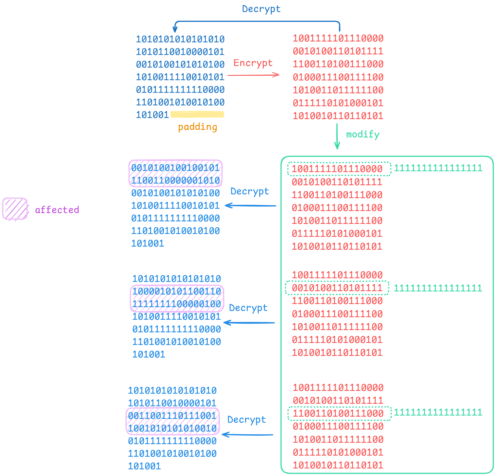

 


# 关卡测试报告【共5关】

## 第一关-基本测试

**目标**：测试 S-AES 算法的基础加密和解密功能，确保 GUI 界面能够支持用户的基本交互。

**内容**：在此关卡中，要求用户输入 16 bit 的明文数据和 16 bit 的密钥。系统需展示 S-AES 算法的基本加密和解密操作。

**测试步骤**：
1. 输入明文为 `1010101010101010`。
2. 输入密钥为 `1100110011001100`。
3. 点击“加密”按钮，系统生成对应的密文（如下图所示）。
4. 使用相同的密钥对密文进行解密，验证解密后的明文是否与初始明文一致。


<br>

---


**结果**：系统成功生成密文并正确解密回原始明文。


## 第二关-交叉测试

**目标**：验证 S-AES 算法的兼容性和稳定性，确保不同的密钥和明文组合在不同的平台或环境下均能正常运作。

**内容**：在此关卡中，用户需要进行算法的“算法标准化”测试。要求用户使用不同的替换表、行混淆矩阵等组合来加解密数据，以确保算法在不同配置和硬件平台上的一致性。

**测试步骤**：
1. 使用 A 组密钥，设置明文为 `1111000011110000`，密钥为 `1010101010101010`。
2. 使用 B 组密钥，设置相同的明文，密钥为 `0101010101010101`。
3. 先使用 A 组密钥对明文加密得到密文。
4. 再用 B 组密钥对该密文解密，验证解密后内容与初始明文一致（如下图所示）。


**结果**：在不同密钥组合下，系统仍能正确加解密，验证算法的兼容性和稳定性。


## 第三关-扩展功能

**目标**：测试系统对不同数据格式的兼容性，确保系统能够处理 ASCII 字符串输入。

**内容**：在此关卡中，用户可以输入 ASCII 编码的字符数据，系统需根据 ASCII 字符编码规则对输入的数据进行加密，并支持将加密后的密文转换为 ASCII 字符串输出。

**测试步骤**：
1. 输入明文为 `Default Security Group`，设置密钥为 `1100110011001100`。
2. 选择 ASCII 格式，点击“加密”按钮。
3. 系统生成 ASCII 编码格式的密文输出（如下图所示）。
4. 使用相同的密钥进行解密，验证是否还原为 `Default Security Group`。


**结果**：系统能够处理 ASCII 输入并正确加解密，确保不同编码格式的兼容性。


## 第四关-多重加密
### 双重加密

**目标**：测试系统的双重加密功能，验证通过 16 bit 的分组数据和 32 bit 密钥的组合对数据加密的效果。

**测试步骤**：
1. 输入明文 `1010101010101010`。
2. 设置密钥1为 `1100110011001100`，密钥2为 `0011001100110011`。
3. 点击“双重加密”按钮，系统使用密钥1和密钥2进行双重加密，生成双重加密的密文（如下图所示）。
4. 使用相同的密钥对密文进行双重解密，验证解密后的明文是否与原始明文一致。


**结果**：系统成功生成双重加密密文，并通过双重解密还原原始明文。


### 中间相遇攻击

**目标**：通过中间相遇攻击模拟破解双重加密，分析加密算法的安全性。

**测试步骤**：
1. 输入明文 `1010101010101010` 和密文 `1100110011001100`。
2. 使用中间相遇攻击模式，系统自动生成可能的密钥对并进行匹配。
3. 系统输出破解过程中发现的密钥对组合和破解时间（如下图所示）。


**结果**：系统能够通过中间相遇攻击找到正确的密钥组合，验证双重加密的安全性。

### 三重加密

**目标**：测试系统的三重加密功能，验证系统是否支持更高层次的加密操作。

**测试步骤**：
1. 输入明文 `1010101010101010`。
2. 设置密钥1为 `1100110011001100`，密钥2为 `0011001100110011`，密钥3为 `1111000011110000`。
3. 选择三重加密模式，点击“加密”按钮。
4. 系统生成三重加密的密文（如下图所示），并可以使用相同密钥进行解密，验证解密结果是否与原始明文一致。


**结果**：系统成功生成三重加密密文，并通过三重解密还原原始明文。


## 第五关-工作模式

**目标**：测试系统在分组链式加密模式（CBC 模式）下的加密性能，分析密文的变化情况。

**内容**：此关卡要求用户在 CBC 模式下对明文进行分组加密，分组大小为 16 bit。测试重点在于确保 CBC 加密的初始向量（IV）生成正确，并确保后续分组在加密过程中的链式传递效果。

**测试步骤**：
1. 输入明文 `101010101010101010101100100001010010100101010100101001111001010101011111111100001101001010010100101001`。
2. 设置密钥为 `1100110011001100`，IV 向量为 `0011001100110011`。
3. 选择 CBC 模式，点击“加密”按钮。
4. 系统生成 CBC 模式的加密密文（如下图所示）。
5. 修改密文中的第一个分组为 `1111111111111111`，重新解密，观察解密后的明文变化，验证 CBC 模式的链式依赖效果。


修改密文分组：




**结果**：系统能够正确生成 CBC 加密的密文，且当分组被修改后，链式依赖导致解密明文相应变化，验证 CBC 模式的安全性。


# 开发手册
## 概述
本手册提供了关于 S-AES 加密算法及其实现的详细说明和使用指南。该算法用于对16位明文和16位密钥进行加密/解密，具有简单、轻量化的特性，适用于教学和小型项目的加密需求。
## 环境配置
- 操作系统：Windows
- 编程语言：Python 3.8+
- 依赖库：
  - `numpy`: 处理矩阵运算
  - `matplotlib`: 进行数据可视化
## 安装步骤
1. 克隆项目代码：
   ```bash
   git clone https://github.com/CoffeeTau/DSG_S-AES_2024.git
   ```
2. 进入项目目录，安装依赖：
   ```bash
   cd DSG_S-AES_2024
   pip install -r requirements.txt
   ```
## 代码结构
项目代码结构如下:

```
├── .git
├── .idea
├── app.py
├── DoubleSAES.py
├── GF2N.py
├── images
├── loginSQL.py
├── README.md
├── SAES.py
├── SBoxBuild.py
├── static
├── StringSAES.py
├── templates
│   ├── error.html
│   ├── index.html
│   ├── system.html
│   └── user-register.html
├── tree.py
├── TripleEncryption.py
├── TripleSAES.py
├── utils.py
└── __pycache__

```

## 模块说明
### 算法部分

算法由多个类和功能函数组成，实现了不同的加密算法或辅助功能。以下是各个文件的详细说明，包括每个文件中的重要类和函数。

---

#### 1. DoubleSAES.py
- **简介**：实现了双重加密（Double Encryption）算法。
- **主要功能**：使用两个不同的密钥对明文进行双重加密，并提供相应的解密函数。
- **重要类和函数**：
  - `class DoubleSAES`：核心类，用于管理双重加密和解密操作。
    - `encrypt(message, key1, key2)`：使用 `key1` 和 `key2` 对 `message` 进行双重加密。
    - `decrypt(ciphertext, key1, key2)`：使用 `key1` 和 `key2` 对 `ciphertext` 进行双重解密。

---

#### 2. GF2N.py
- **简介**：实现了有限域 GF(2^n) 的数学运算，用于支持 S-AES 算法中的多项式和代数运算。
- **主要功能**：提供有限域上的加法、乘法和求逆操作，是实现 S-Box 和其他非线性变换的基础。
- **重要函数**：
  - `add(x, y)`：有限域上的加法。
  - `multiply(x, y)`：有限域上的乘法。
  - `inverse(x)`：计算元素的逆，用于 S-Box 的构建。

---

#### 3. SAES.py
- **简介**：实现了简化的 AES（S-AES）算法，包括加密和解密函数。
- **主要功能**：支持单重加密操作，通过 16-bit 分组和 16-bit 密钥实现基础加密。
- **重要类和函数**：
  - `class SAES`：主要的 S-AES 加解密类。
    - `encrypt_block(block, key)`：对 16-bit 的数据块 `block` 使用 `key` 进行加密。
    - `decrypt_block(block, key)`：对密文块进行解密，返回明文。
    - `substitute_bytes(data)`：实现 S-Box 替换。
    - `shift_rows(data)`：行移位操作，用于增强加密的扩散性。

---

#### 4. StringSAES.py
- **简介**：将 S-AES 算法应用于字符串输入，实现对文本的加密和解密。
- **主要功能**：支持将字符串明文分块进行加密，并还原回原始文本。
- **重要类和函数**：
  - `class StringSAES`：用于字符串加密的 S-AES 类。
    - `encrypt_text(text, key)`：对字符串 `text` 使用 `key` 进行加密，返回密文。
    - `decrypt_text(ciphertext, key)`：解密字符串密文，返回原始文本。

---

#### 5. TripleEncryption.py
- **简介**：实现了三重加密（Triple Encryption）算法，使用三轮 S-AES 加密以增强安全性。
- **主要功能**：允许用户选择不同的密钥组合方式，如 32-bit 或 48-bit 密钥，以提供更高的安全性。
- **重要类和函数**：
  - `class TripleEncryption`：三重加密类，管理三重加密和解密流程。
    - `encrypt(message, key1, key2, key3)`：依次使用三个密钥对 `message` 进行三次加密。
    - `decrypt(ciphertext, key1, key2, key3)`：依次使用三个密钥对 `ciphertext` 进行解密，还原为原始明文。

---

#### 6. TripleSAES.py
- **简介**：TripleSAES 的主实现文件，提供三重加密的核心逻辑。
- **主要功能**：包含三重加密和解密函数，通过三轮 S-AES 加密提供更高级别的安全保护。
- **重要类和函数**：
  - `class TripleSAES`：三重 S-AES 加解密类。
    - `encrypt_block(block, key1, key2, key3)`：对 16-bit 数据块 `block` 进行三次加密。
    - `decrypt_block(block, key1, key2, key3)`：对密文块进行三次解密，返回原始数据块。

---

这些模块共同构成了一个完整的加密服务系统，支持多种加密模式和安全功能。每个模块中的类和函数相互配合，实现了多重加密和多种数据加密模式，以满足不同的安全需求。


### 前后端部分

#### 前端说明

前端使用 HTML、JavaScript 和 CSS 构建用户友好的界面，允许用户进行加解密操作及统计分析，功能包括：

- **服务展示**：
  - 介绍 S-AES 算法功能，动态展示每项服务的详细内容。

- **明文/密文输入区域**：
  - **明文/密文**：用户可以在该文本区域中输入要加密或解密的内容。
  - **明文/密文类型选择**：用户可以选择 `bit` 或 `ASCII` 格式，分别对应 `01` 串或 ASCII 字符串。

- **密钥与 IV 输入**：
  - **密钥输入**：用户可以输入最多三个密钥，支持单次、双重、三重加密操作。
  - **IV 向量输入**：用于 CBC 模式的初始化向量（IV），输入一个 16 位的 `01` 串作为 CBC 加解密的初始值。

- **加密操作**：
  - **单次加密**：使用第一个密钥对明文进行单次加密。
  - **双重加密**：使用第一个和第二个密钥进行两次加密。
  - **三重加密**：使用三个密钥进行三次加密。
  - **CBC 加密**：使用第一个密钥和 IV，以 CBC 模式对明文进行加密。

- **生成的密文显示**：
  - 生成的密文会显示在只读的 `textarea` 中，支持长文本滚动查看，用户可以选择并复制密文。

- **解密操作**：
  - **单次解密**：使用第一个密钥对密文进行单次解密。
  - **双重解密**：使用第一个和第二个密钥进行两次解密。
  - **三重解密**：使用三个密钥进行三次解密。
  - **CBC 解密**：使用第一个密钥和 IV，以 CBC 模式对密文进行解密。

- **解密出的明文显示**：
  - 解密后的明文显示在只读的 `textarea` 中，支持长文本滚动查看，用户可以选择并复制明文。

- **中间相遇攻击测试**：
  - **明文输入**：用户输入一个 16 位的明文。
  - **密文输入**：用户输入一个 16 位的密文。
  - **破解操作**：点击破解按钮进行中间相遇攻击测试。
  - **输出**：显示破解的时间、破解次数和破解出的密钥。


#### 后端说明

后端使用 Flask 框架实现 S-AES 算法的加解密、统计分析及暴力破解功能，包括：

- **路由设置**：
  - 定义不同路由，处理相应请求，例如：
    - `/encrypt` 和 `/decrypt` 路由：用于接收加密和解密请求，调用加解密逻辑。
    - `/cbc_encrypt` 和 `/cbc_decrypt` 路由：分别处理 CBC 模式的加密和解密请求。
    - `/generate-scatter` 路由：生成用于雪崩效应分析的统计数据。
    - `/brute-force` 路由：实现暴力破解功能。

- **加解密功能**：
  - 接收前端数据，调用 `encryptOrDecrypt` 方法进行加密或解密，并返回结果。
  - 处理不同加密模式（单重、双重、三重和 CBC），确保密钥和 IV 格式正确，结果以 JSON 格式返回。

- **CBC 加解密逻辑**：
  - **加密过程**：
    - 接收明文和 IV，判断 `bit` 或 `ASCII` 格式，使用 AES CBC 模式加密。
    - 返回密文，格式可选 `01` 串或 Base64 ASCII。
  - **解密过程**：
    - 接收密文、密钥和 IV，判断格式，使用 AES CBC 模式解密。
    - 移除 PKCS7 填充后，返回明文字符串。

- **数据格式处理**：
  - 解析前端数据，将明文、密钥和密文转换为必要格式。前端选择的格式（`bit` 或 `ASCII`）会影响密文的解码方式，确保数据在传输过程中以 JSON 格式返回。


## 依赖库

- **Flask**：用于处理后端路由和 API 请求，提供加解密、暴力破解及统计分析服务。
- **Cryptography**：核心加密算法库，支持 AES 加密和 CBC 模式。
- **Base64**：用于将密文转换为可读的 ASCII 格式，支持前端格式选项。

## 注意事项

- **密钥和 IV 长度**：AES 加解密要求密钥和 IV 为 16 字节（128 位）。
- **数据格式**：确保前端输入数据格式与后端解析格式一致，避免解析错误。
- **网络请求**：前端通过 `fetch` 发送 API 请求，确保前后端在同一域，或配置跨域支持。


# 用户指南

欢迎使用 S-AES 加密算法工具！本指南将帮助您理解如何使用该工具进行加解密、多重加密、中间相遇攻击、CBC模式等功能。

## 1. 登录与注册

### 1.1 登录
1. 打开网页，您将首先看到登录界面。
2. 输入您的用户名和密码。
3. 点击“登录”按钮。
4. 如果凭证正确，系统将进入主界面；否则，将显示错误消息。
   

### 1.2 注册
1. 在登录界面，点击“注册”按钮。
2. 输入所需的注册信息，如用户名、密码等。
3. 点击“提交”按钮。
4. 注册成功后，您可以使用新账户登录。
   


## 关于我们
我们是一个致力于数据安全和加密技术的团队，旨在提供简洁易用的加密工具，以帮助用户保护他们的数据隐私。欢迎随时与我们联系，获取更多信息。


# 常见问题

## 1. **什么是 SAES 算法？**
   SAES（简化版高级加密标准）是一种简化的对称加密算法，常用于教学目的。它采用较小的密钥和数据块长度，通过多轮加密步骤，帮助理解 AES 的基本原理。

## 2. **如何在 SAES 中实现中间相遇攻击？**
   中间相遇攻击是一种常用的密码分析方法，适用于双重加密等多轮加密的破解。在 SAES 中，可以通过比对加密和解密的中间值来寻找密钥对，并记录执行时间来评估攻击的效率。

## 3. **SAES 与 AES 的区别是什么？**
   SAES 是 AES 的简化版本，通常使用较小的密钥和数据块。虽然两者加密流程相似，但 AES 采用更长的密钥、更大的数据块和更多的加密轮数，比 SAES 更加安全且适用于实际应用场景。
